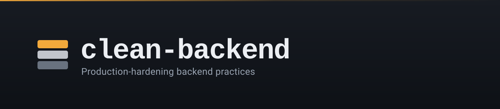

<div align="center">



**The backend practices that keep production boring.**

[](https://github.com/AllanOps/Clean-Backend/actions/workflows/ci.yml)
[](https://github.com/AllanOps/Clean-Backend/actions/workflows/actions-security.yml)
[](https://github.com/AllanOps/Clean-Backend/releases)
[](LICENSE)
[](https://docs.claude.com/en/docs/claude-code/plugins)

</div>

> [!NOTE]
> **Clean-Backend is a [Claude Code](https://claude.com/claude-code) skill.** Install it once, and Claude applies these production-hardening practices whenever it designs, writes, or reviews your backend code — endpoints, payment flows, deletes, background jobs, and alerting.

They aren't clever. They're the habits that separate a service which survives Black Friday from one that takes the company down with it — the kind of thing that *looks* like overhead in review, and then saves you at 3am.

---

## Install

### As a Claude Code plugin (recommended)

```text
/plugin marketplace add AllanOps/Clean-Backend
/plugin install clean-backend@allanops
```

Then either invoke it explicitly with `/clean-backend:clean-backend`, or just ask Claude to write or review some backend code — it will pull the skill in on its own from the description.

### Manual install (any agent that reads `~/.claude/skills`)

```bash
git clone https://github.com/AllanOps/Clean-Backend.git
cp -r Clean-Backend/skills/clean-backend ~/.claude/skills/clean-backend
```

Installed this way the skill is invoked as plain `/clean-backend`.

---

## See it in action

Every trick is a **trap → fix** pair. Here's #3, the single most common source of customer pain:

> [!IMPORTANT]
> *"I clicked, but it didn't work, so I clicked again... and now I got charged twice."*

```ts
// The Trap — retry charges twice
POST /charges { amount: 4900 }

// The Fix — stable key, server dedupes
POST /charges
Idempotency-Key: 8f2c...-94d1
if (seen(key)) return cached(key);
return cache(key, charge(amount));
```

Refresh, retry, network blip — the user's intent was *one* charge. **Anywhere money or state moves, charge a key.**

---

## The tricks

| # | The habit | The law |
| --: | --- | --- |
| 1 | [Send less data than you think](skills/clean-backend/SKILL.md#1-send-less---always-send-less) | Pick fields per endpoint, not per model. |
| 2 | [Timeouts on every I/O](skills/clean-backend/SKILL.md#2-timeouts-on-http-are-the-easy-half) | Anything that crosses a process boundary can hang. |
| 3 | [Idempotency keys where money moves](skills/clean-backend/SKILL.md#3-make-the-second-click-no-op-not-a-bug) | Make the second click a no-op, not a bug. |
| 4 | [Validate at the door](skills/clean-backend/SKILL.md#4-reject-early-spare-the-database) | Schema-validate at the controller, not the table. |
| 5 | [Feature flags by default](skills/clean-backend/SKILL.md#5-deploying-is-not-the-same-as-releasing) | Deploying is not the same as releasing. |
| 6 | [Async the heavy work](skills/clean-backend/SKILL.md#6-if-a-request-waits-for-it-it-shouldnt) | If the user doesn't need it in a millisecond, queue it. |
| 7 | [Internal rate limits + breakers](skills/clean-backend/SKILL.md#7-rate-limit-users-then-rate-limit-yourselves) | Internal calls deserve buckets and breakers, not blind retries. |
| 8 | [Version the API from day one](skills/clean-backend/SKILL.md#8-version-the-api-from-day-one) | Mobile apps live longer than your refactors. |
| 9 | [Soft delete, not `DELETE`](skills/clean-backend/SKILL.md#9-soft-delete-not-delete) | `DELETE` is forever; `deleted_at` is just a Tuesday afternoon. |
| 10 | [Alert on business metrics](skills/clean-backend/SKILL.md#10-alert-on-business-metrics-not-cpu) | Healthy servers can serve a totally broken product. |
| 11 | [Plan the failure, make it boring](skills/clean-backend/SKILL.md#11-plan-the-failure-make-it-boring) | Degrade, don't die. |
| 12 | [Names beat comments](skills/clean-backend/SKILL.md#12-names-beat-comments) | Renaming is the cheapest high-leverage rewrite you'll ever ship. |

**[Read the full skill →](skills/clean-backend/SKILL.md)**

---

## Why you can trust this repo

A skill is *instructions injected into your agent*, so every change is treated like a supply-chain change:

- **Schema-validated** — CI checks the skill and plugin manifests against the Agent Skills spec on every PR.
- **Scanned for prompt injection** — CI hard-fails on hidden/invisible Unicode, encoded blobs, raw-IP links, and instructions that would steer an agent to exfiltrate or execute anything.
- **Locked-down automation** — GitHub Actions are pinned by commit SHA, run with read-only tokens, and are themselves audited by [zizmor](https://github.com/zizmorcore/zizmor).

See [SECURITY.md](SECURITY.md) for the full threat model and how to report a vulnerability privately.

---

## Contributing

Got a hard-won backend habit that belongs here? **[Open a "new trick" issue first](https://github.com/AllanOps/Clean-Backend/issues/new/choose)** so we can agree on it before you write the PR. The exact trap-vs-fix format, style rules, and local checks are in **[CONTRIBUTING.md](CONTRIBUTING.md)**.

By contributing you agree your work is licensed under the same MIT license as the project.

---

## License

[MIT](LICENSE) © AllanOps
